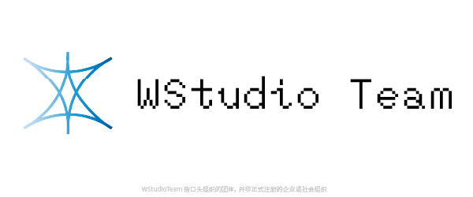

### 精选项目
- [🤖 简易AI对话](https://github.com/captain-wangrun-cn/nonebot-plugin-aitalk)  
  简单好用的NoneBot AI聊天插件  
  主要语言: Python  
  项目类型: NoneBot插件

- [🔣 简易消息过滤器](https://github.com/captain-wangrun-cn/SimpleBotMessageFilter)  
  一个简易的，适用于onebotv11协议的，提供给bot的，消息过滤器  
  主要语言: Python  
  项目类型: 简易程序

---

### 关于我
- 业余开发者+苦逼高中生（编辑于2025）
- 对游戏开发，服务器维护，技术相关有浓厚兴趣
- ~~史山制造者~~

**座右铭**:  
```
『用科学无法证明的东西不一定就是虚假的』
```

**WakaTime**:  
<!--START_SECTION:waka-->

```python
Total Time: 109 hrs 6 mins

Python       84 hrs 48 mins  ███████████████████░░░░░░   76.40 %
Markdown     10 hrs 29 mins  ██▒░░░░░░░░░░░░░░░░░░░░░░   09.46 %
HTML         4 hrs 53 mins   █░░░░░░░░░░░░░░░░░░░░░░░░   04.41 %
JSON         4 hrs 7 mins    █░░░░░░░░░░░░░░░░░░░░░░░░   03.72 %
Other        1 hr 53 mins    ▒░░░░░░░░░░░░░░░░░░░░░░░░   01.71 %
```

<!--END_SECTION:waka-->  
加入日期：2024 年 11 月 23 日

### 技术领域
- **编程语言**: Python, HTML, JavaScript, C#, ~~English~~, ...
- **游戏开发**: Unreal Engine
- **服务器**: Web相关, ...
- **计划学习**: 机器学习, ~~数理化~~

### 技术理念(?)
- ~~能用就行~~
- 尝试新事物
- 乐于教别人

### 其他
- 蔚蓝档案忠实玩家  


- 有一个非正式游戏团队  
[WStudio Team](http://wstudio.work/)  


---

### 联系我
- GitHub: [github.com/captain-wangrun-cn](https://github.com/captain-wangrun-cn)
- 邮箱: wangrun114514@foxmail.com（主）wangrun@wstudio.work（副）

### 社交媒体
[](https://space.bilibili.com/1775320924)
[](https://qm.qq.com/q/QDKeqYb7iy)
[](https://x.com/wngrn12579745)

<!-- 
  如果你看到这个，祝你今天写出无bug的代码
-->
